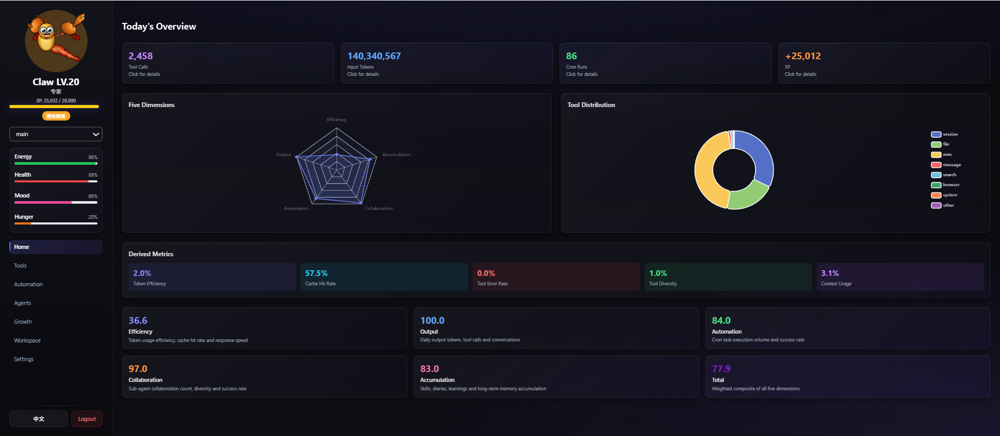
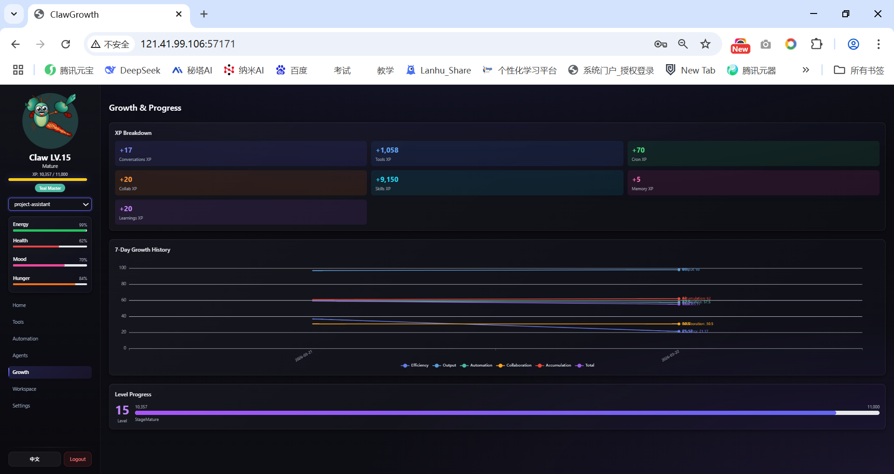
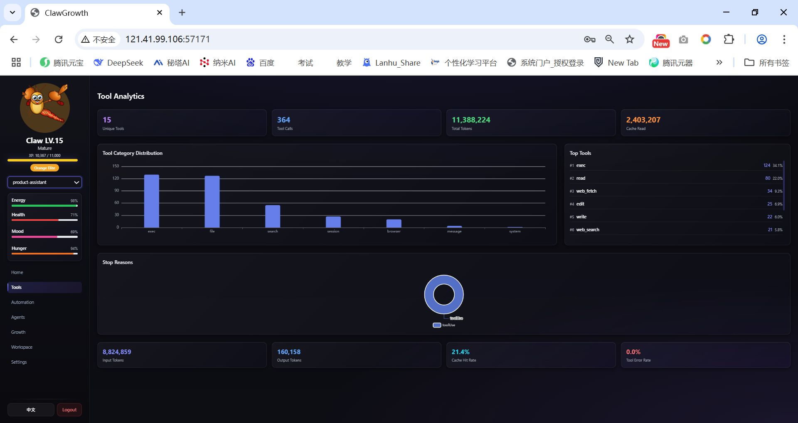
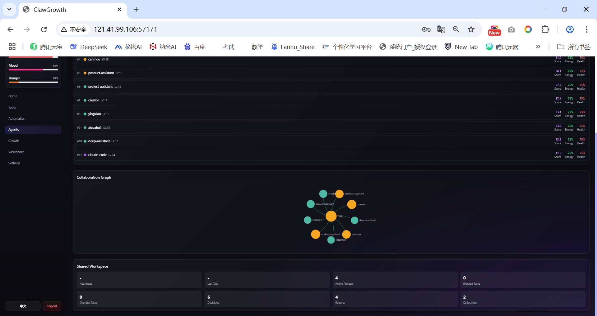
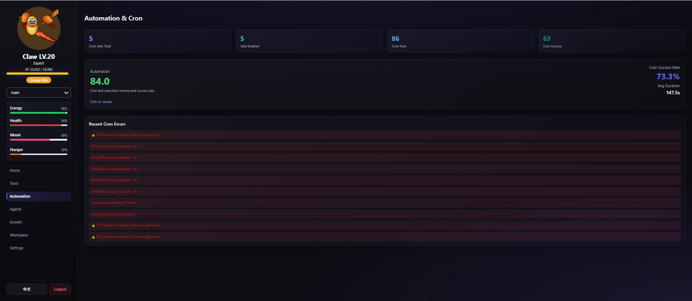
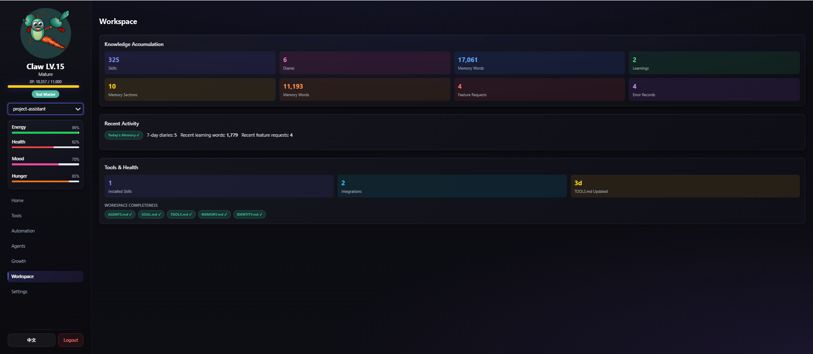

<p align="center">
  
</p>

<h1 align="center">🦞 ClawGrowth</h1>

<p align="center">
  <strong>OpenClaw Agent 成长指标看板</strong>
</p>

<p align="center">
  <a href="./README.md">English</a> •
  <a href="#功能特性">功能特性</a> •
  <a href="#快速开始">快速开始</a> •
  <a href="#系统截图">系统截图</a> •
  <a href="#文档">文档</a>
</p>

<p align="center">
  
  
  
</p>

---

## 🎯 什么是 ClawGrowth？

ClawGrowth 是一个为 [OpenClaw](https://github.com/anthropics/openclaw) Agent 设计的**游戏化指标看板**。它将原始的 Agent 数据转化为有意义的可视化图表，帮助你了解 AI Agent 的工作状态、成长轨迹和协作关系。

可以把它想象成 **AI Agent 的健身追踪器** — 监控健康状态、追踪成长进度、庆祝每一个成就。

---

## ✨ 功能特性

### 📊 实时仪表盘
- 实时 Agent 状态监控
- 可交互的指标卡片，支持下钻查看详情
- 响应式深色主题，玻璃态设计

### 🎮 游戏化系统
- **经验值与等级** — 通过对话、工具使用等获得经验
- **5个成长阶段** — 幼苗 → 成长 → 成熟 → 专家 → 传说
- **5个颜色等级** — 紫色 → 蓝色 → 青绿 → 橙色 → 红色
- **成就系统** — 解锁里程碑成就

### 📈 五维评分体系
| 维度 | 权重 | 衡量指标 |
|------|------|----------|
| 效率分 | 25% | Token 效率、缓存命中、响应速度 |
| 产出分 | 25% | Token 输出、工具调用、对话轮次 |
| 自动化分 | 20% | Cron 执行量和成功率 |
| 协作分 | 15% | 多 Agent 交互 |
| 积累分 | 15% | 技能、记忆、学习记录 |

### 🏥 四状态监控
- **精力 (Energy)** — 上下文容量与新鲜度
- **健康 (Health)** — Cron 质量与工具可靠性
- **心情 (Mood)** — 交互质量与活跃度
- **饥饿 (Hunger)** — 学习新鲜度与深度

### 📉 分析与历史
- 7日成长趋势图
- 工具使用分布分析
- Cron 任务监控
- 工作空间完整性指标

### 🤝 协作网络
- 可视化 Agent 间的交互关系
- 追踪协作模式
- 监控共享工作空间活动

---

## 📸 系统截图

<table>
  <tr>
    <td></td>
    <td></td>
  </tr>
  <tr>
    <td align="center"><em>概览仪表盘</em></td>
    <td align="center"><em>成长与进度</em></td>
  </tr>
  <tr>
    <td></td>
    <td></td>
  </tr>
  <tr>
    <td align="center"><em>工具分析</em></td>
    <td align="center"><em>Agents 概览</em></td>
  </tr>
  <tr>
    <td></td>
    <td></td>
  </tr>
  <tr>
    <td align="center"><em>自动化与 Cron</em></td>
    <td align="center"><em>工作空间</em></td>
  </tr>
</table>

---

## 🚀 快速开始

### 环境要求

| 组件 | 最低版本 | 推荐版本 | 说明 |
|------|----------|----------|------|
| Python | 3.6+ | 3.9+ | 后端运行环境 |
| pip | 19.0+ | 最新 | Python 包管理 |
| Node.js | - | - | 前端无需（纯静态） |
| OpenClaw | - | 最新 | 被监控的 Agent 系统 |

### 步骤 1：克隆仓库

```bash
git clone https://github.com/anthropics/clawgrowth.git
cd clawgrowth
```

#### 步骤 2：启动后端（必须先启动）

```bash
# 进入后端目录
cd backend

# 安装依赖
pip install -r requirements.txt

# 启动后端服务
python3 app.py
```

**启动成功标志：**
```
INFO:     Uvicorn running on http://0.0.0.0:57178 (Press CTRL+C to quit)
```

**验证后端：**
```bash
curl http://localhost:57178/health
# 应返回: {"ok":true}
```

#### 步骤 3：启动前端（另开终端）

```bash
# 进入前端目录
cd frontend

# 方式 A：Python 内置服务器
python3 -m http.server 57177

# 方式 B：使用 Nginx（生产环境推荐）
# 将 frontend 目录配置为 Nginx 根目录
```

**启动成功标志：**
```
Serving HTTP on 0.0.0.0 port 57177 ...
```

#### 步骤 4：访问系统

- **前端地址**: http://localhost:57177
- **API 地址**: http://localhost:57178
- **默认密码**: `deepquest.cn`

---

### 启动顺序说明

```
┌─────────────────────────────────────────────────────────┐
│                     启动顺序                             │
├─────────────────────────────────────────────────────────┤
│                                                         │
│   1. 后端 (必须先启动)                                   │
│      └── python3 backend/app.py                         │
│          └── 监听 :57178                                │
│          └── 初始化数据库                                │
│          └── 启动调度器                                  │
│                                                         │
│   2. 前端 (后端就绪后启动)                               │
│      └── python3 -m http.server 57177                   │
│          └── 监听 :57177                                │
│          └── 通过 /api/* 代理到后端                      │
│                                                         │
└─────────────────────────────────────────────────────────┘
```

> ⚠️ **重要**：前端依赖后端 API，必须先启动后端！

---

### 后台运行（生产环境）

#### 使用 nohup

```bash
# 后端后台运行
cd backend
nohup python3 app.py > logs/app.log 2>&1 &

# 前端后台运行
cd frontend
nohup python3 -m http.server 57177 > ../backend/logs/frontend.log 2>&1 &
```

#### 使用 systemd（推荐）

创建服务文件 `/etc/systemd/system/clawgrowth.service`：

```ini
[Unit]
Description=ClawGrowth Backend
After=network.target

[Service]
Type=simple
User=your_user
WorkingDirectory=/path/to/clawgrowth/backend
ExecStart=/usr/bin/python3 app.py
Restart=always
RestartSec=10

[Install]
WantedBy=multi-user.target
```

启用服务：
```bash
sudo systemctl daemon-reload
sudo systemctl enable clawgrowth
sudo systemctl start clawgrowth
```

---

### 常见问题

#### Q: 前端访问显示空白或报错？
**A**: 检查后端是否启动成功：
```bash
curl http://localhost:57178/health
```

#### Q: 端口被占用？
**A**: 修改端口：
```bash
# 后端端口
export CLAWGROWTH_PORT=8080
python3 app.py

# 前端端口
python3 -m http.server 8081
```

#### Q: 看不到任何 Agent 数据？
**A**: 确认 OpenClaw 目录配置正确：
```bash
export CLAWGROWTH_OPENCLAW_ROOT=~/.openclaw
python3 app.py
```

#### Q: 如何修改默认密码？
**A**: 登录后在设置页面修改，或删除 `backend/data/config.json` 重置为默认密码。

---

## ⚙️ 配置说明

ClawGrowth 支持两种配置方式，优先级从高到低：
1. **环境变量** - 适合 Docker、CI/CD 等场景
2. **配置文件** - 适合本地部署，更直观

### 方式一：配置文件（推荐）

复制示例配置文件并修改：

```bash
cp config.example.json config.json
```

编辑 `config.json`：

```json
{
  "openclaw_root": "~/.openclaw",
  "db_path": "",
  "host": "0.0.0.0",
  "port": 57178,
  "scheduler_enabled": true,
  "collect_hourly": true,
  "cleanup_hour": 3,
  "tool_retention_days": 7,
  "cron_retention_days": 30
}
```

> ⚠️ **重要**：`openclaw_root` 必须指向你的 OpenClaw 安装目录，否则无法读取 Agent 数据！

**常见配置示例**：

```json
// Linux/macOS 默认安装
{ "openclaw_root": "~/.openclaw" }

// 自定义安装路径
{ "openclaw_root": "/opt/openclaw" }

// Windows
{ "openclaw_root": "C:/Users/YourName/.openclaw" }
```

### 方式二：环境变量

| 变量 | 配置文件字段 | 默认值 | 说明 |
|------|-------------|--------|------|
| `CLAWGROWTH_OPENCLAW_ROOT` | `openclaw_root` | `~/.openclaw` | OpenClaw 安装目录 |
| `CLAWGROWTH_DB_PATH` | `db_path` | `{openclaw_root}/clawgrowth/clawgrowth.db` | 数据库路径 |
| `CLAWGROWTH_HOST` | `host` | `0.0.0.0` | API 服务器地址 |
| `CLAWGROWTH_PORT` | `port` | `57178` | API 服务器端口 |
| `CLAWGROWTH_SCHEDULER` | `scheduler_enabled` | `true` | 启用内置调度器 |
| `CLAWGROWTH_COLLECT_HOUR` | `collect_hourly` | `true` | 每小时采集数据 |
| `CLAWGROWTH_CLEANUP_HOUR` | `cleanup_hour` | `3` | 每日清理时间（0-23） |
| `CLAWGROWTH_TOOL_DAYS` | `tool_retention_days` | `7` | 工具日志保留天数 |
| `CLAWGROWTH_CRON_DAYS` | `cron_retention_days` | `30` | Cron 日志保留天数 |

### 前端配置

前端是纯静态单页应用，**无需构建，无需 Node.js**。

**默认行为**：使用同源 API（前后端同域部署时自动工作）

**自定义 API 地址**（前后端分离部署时）：
```bash
# 复制并编辑配置文件
cp frontend/config.example.js frontend/config.js
```

编辑 `frontend/config.js`：
```javascript
window.CLAWGROWTH_API_BASE = 'http://your-backend-server:57178';
```

> 💡 `config.js` 会被自动加载（如果存在），无需修改 `index.html`

### 认证配置

默认密码：`deepquest.cn`

修改密码：
1. 登录 → 设置 → 修改密码
2. 或手动生成哈希：`echo -n "your_password" | sha256sum`

---

## 📡 API 接口

| 方法 | 路径 | 说明 |
|------|------|------|
| GET | `/health` | 健康检查 |
| POST | `/api/auth/login` | 登录 |
| POST | `/api/auth/logout` | 登出 |
| POST | `/api/auth/change-password` | 修改密码 |
| GET | `/api/auth/check` | 验证 Token |
| GET | `/api/agents` | 所有 Agent 概览 |
| GET | `/api/agent/{id}` | Agent 详情 |
| GET | `/api/agent/{id}/history` | 历史数据 |
| GET | `/api/shared` | 共享工作空间统计 |
| POST | `/api/collect-all` | 触发数据采集 |
| POST | `/api/cleanup` | 触发数据清理 |
| GET | `/api/scheduler/status` | 调度器状态 |

---

## 📖 文档

- [算法规则](docs/zh/algorithm-rules.md) — 评分公式和计算逻辑
- [数据库设计](docs/zh/database-design.md) — 表结构和数据流
- [API 参考](docs/zh/api-reference.md) — 完整 API 文档

---

## 🛠️ 项目结构

```
ClawGrowth/
├── backend/
│   ├── app.py              # FastAPI 应用
│   ├── config.py           # 配置文件
│   ├── database.py         # SQLite 表结构
│   ├── service.py          # 业务逻辑
│   ├── calculators/        # 评分算法
│   │   ├── scores.py       # 五维评分
│   │   ├── status.py       # 四状态计算
│   │   └── xp.py           # 经验值与等级
│   ├── collectors/         # 数据采集器
│   │   ├── session_parser.py
│   │   ├── cron_parser.py
│   │   └── workspace_scanner.py
│   └── data/
│       └── config.json     # 密码配置
├── frontend/
│   ├── index.html          # 单页应用
│   └── config.example.js   # 前端配置示例
├── docs/
│   ├── en/                 # 英文文档
│   └── zh/                 # 中文文档
├── config.example.json     # 后端配置示例
├── LICENSE
├── CHANGELOG.md
└── README.md
```

---

## 🤝 参与贡献

欢迎贡献代码！请随时提交 Pull Request。

1. Fork 本仓库
2. 创建特性分支 (`git checkout -b feature/amazing-feature`)
3. 提交更改 (`git commit -m '添加超棒的功能'`)
4. 推送到分支 (`git push origin feature/amazing-feature`)
5. 创建 Pull Request

---

## 📄 开源协议

本项目采用 MIT 协议 - 详见 [LICENSE](LICENSE) 文件。

---

## 👤 作者

**DeepQuest.cn**

- 微信：`deepquestai`
- 网站：[deepquest.cn](https://deepquest.cn)

<p align="center">
  
</p>

---

<p align="center">
  为 OpenClaw 社区用心打造 ❤️
</p>
